<div align="center">
# kodawari

**Autopilot for autonomous software delivery — PRD to shipped feature with strict no-fake-run guarantees.**

[](https://www.python.org/downloads/)
[](LICENSE)
[](#status)
[](https://github.com/liafei/kodawari/actions/workflows/test.yml)

[English](README.md) · [中文](README.zh-CN.md) · [Deep dive](docs/PIPELINE_DEEP_DIVE.md) · [Quickstart](docs/QUICKSTART.md) · [Examples](examples/)

</div>

> *拘り (kodawari)* — the Japanese concept of obsessive attention to detail, the
> craftsman's refusal to accept anything less than what the work demands.

**kodawari** is an open-source autopilot for AI-driven software development.
It coordinates multiple LLMs — a **planner** drafting the design, an
independent **reviewer** auditing it, and an **executor** writing the code —
to turn a PRD or feature spec into shipped, tested code with full audit-able
artifacts at every step.

If you've used **Claude Code**, **Cursor**, **Aider**, or **OpenHands** and
wanted a more rigorous, workflow-driven alternative — one that enforces real
`pytest` runs and real peer review instead of single-model self-approval —
kodawari is built for that.

**Key concepts**: AI pair programming · agentic coding · multi-LLM
orchestration · contract-first artifacts · greenfield project scaffolding ·
test-driven AI development

You write a markdown describing the feature you want — a PRD, a task spec,
a feature brief, an internal RFC, whatever your team writes. kodawari reads
it, plans the implementation, writes the code, runs the tests, and hands
back a feature ready for your ship-or-not decision.

> The CLI takes the file via `--prd <path>` or `--requirements-file <path>`
> (either flag works). Filename and document type don't matter — the intake
> parser looks at **structure**: goals, scope, data contract, layers,
> acceptance criteria. The 5-section recipe is in
> [`docs/WRITING_PRD.md`](docs/WRITING_PRD.md).

---

## ⚡ Quick start

```bash
pip install -e .                                # Python 3.11+
kodawari init-wizard                            # one-time config (interactive)
kodawari work-all --feature my-feature --prd ./PRD.md
```

That's the whole user-facing API for a real run. Two flags. Defaults
(peer review on, 5 cycles per task, 1h wall-clock ceiling, advisory
gate) are tuned for production use; override per-project via
`.claude/workflow/defaults.yaml` (generated by the wizard) or per-run
via CLI flags.

See [`examples/hello-bookmark/`](examples/hello-bookmark/) for a walkable
5-minute end-to-end demo (empty dir → FastAPI service + SQLite + tests,
generated entirely by the autopilot).

---

## 🗺️ How it works

```mermaid
flowchart LR
    PRD([📄 PRD.md]) --> TIER[Stage 0-1<br/>complexity tier<br/>+ slice detection]
    TIER --> PLAN[Stage 2<br/>planner ↔ reviewer<br/>multi-round revision]
    PLAN --> GRAPH[Stage 3-4<br/>architecture + scaffold<br/>+ TASK_GRAPH]
    GRAPH --> D[DESIGN]
    D --> I[IMPLEMENT]
    I --> V[VERIFY<br/>real pytest]
    V --> R[RULES_GATE<br/>code redline]
    R --> RV[PEER_REVIEW<br/>impl_reviewer]
    RV -.must_fix.-> I
    RV --> BUNDLE[Stage 6-7<br/>review bundle<br/>+ release gate]
    BUNDLE -->|kodawari decide| SHIP([🚀 Ship])

    style PRD fill:#e8f4f8,stroke:#5c8aa0
    style SHIP fill:#d4f4dd,stroke:#3a8050
    style V fill:#fff4d6,stroke:#c89432
    style RV fill:#fff4d6,stroke:#c89432
```



The dotted arrow from PEER_REVIEW back to IMPLEMENT is the
self-healing fix-loop: when the reviewer flags `must_fix` items, the
executor re-implements and verify + review re-run. Loop continues until
approved or `max_cycles` hit.

### The 5 steps in plain language

**1. Read + slice.** If the spec has `## Slice 1:` `## Slice 2:` markers,
kodawari processes them in sequence. Otherwise it treats the whole spec
as one unit.

**2. Plan.** A planner model drafts the implementation (files to change,
tests to write, contract details). A reviewer model audits the plan. If
the reviewer raises must-fix issues, the planner revises. Loop until
they converge.

**3. Generate task graph.** The approved plan becomes 5–7 small tasks,
each focused on a tight group of files. Dependencies between tasks are
recorded.

**4. Execute.** For each task in dependency order, the full cycle runs:
the executor model writes code via constrained tool-use (read /
str_replace / write_new_file) → pytest actually runs → the code-quality
gate actually runs → a reviewer model audits the implementation. If the
reviewer flags must-fix, the executor re-implements and verify + review
re-run. Approved → next task.

**5. Ship gate.** After all tasks pass, kodawari packages the changes
into a review bundle and stops at a manual ship decision. Run `kodawari
decide --action accept` to ship or `--action reject` to halt.

For multi-slice specs, **steps 2–4 run once per slice**; step 5 runs
once across all slices at the end.

### Roles

**Three LLM roles**, independently configured in `.claude/workflow/models.yaml`:

| Role | What it does | Examples |
|---|---|---|
| **Planner** | Drafts and revises plans; reads PRD, prior findings, repo inventory | gpt-5, claude-opus, gemini-pro |
| **Reviewer** (plan + impl) | Audits plans and code; can block with must-fix items | claude-opus, mimo, gpt-4o |
| **Executor** | Writes code via strict tool-use protocol; cannot violate file scope | mimo, codex, claude-haiku |

Mix providers: cheap planner + premium reviewer + local executor is a
common setup. Multi-slice PRDs (`## Slice 1:` … `## Slice 2:` markers)
auto-iterate slice-by-slice with resume support.

Full internal flow — every stage, every safety mechanism's code
location — see [docs/PIPELINE_DEEP_DIVE.md](docs/PIPELINE_DEEP_DIVE.md).

---

## 🤔 Why kodawari?

| Tool | Posture | What kodawari does differently |
|---|---|---|
| **Claude Code / Codex CLI** | Interactive REPL with one model per turn | Multi-model role separation + contract-first artifact chain. 5 chat sessions ≠ one planned PRD-driven feature. |
| **Cursor / Windsurf** | IDE-embedded editor with copilot+chat | Headless, scriptable, CI-friendly. No editor lock-in. Every step writes a JSON artifact for audit. |
| **Aider** | Git-aware pair-programmer for incremental edits | Greenfield-first (empty dir → shipped feature), strict verify+review gates that fail closed, planner can reject its own plan. |
| **OpenHands / Devin** | General-purpose autonomous agents | Narrower scope (Python project shipping), stricter no-fake-run guarantees, smaller blast radius. |

**Pick kodawari when you need:**

- A PRD → shipped feature **pipeline** rather than a chat session.
- Hard guarantees that "verify passed" actually means `pytest` ran and returned 0.
- Multi-LLM where each role is independently configurable.
- A CI-friendly autopilot that writes machine-readable artifacts at every step.

If you want a chatty pair-programmer, use one of the others — kodawari is
opinionated and process-heavy on purpose.

---

## 🛡️ What you get

- **No-fake-run policy**: under `KODAWARI_REVIEW_ENABLED=1`, every reviewer
  call, verify command, and gate decision is anchored to a real artifact.
  Silent-pass fallback paths fail closed.
- **Contract-first artifact chain**: PRD → INTAKE → ARCHITECTURE_PLAN →
  TASK_GRAPH → TASK_CARD is JSON-schema validated end to end.
- **Greenfield first-class**: empty directory + PRD → shipped feature. A
  `SCAFFOLD_MANIFEST` locks the chosen archetype so the planner doesn't
  re-infer it on the near-empty filesystem.
- **Wall-clock watchdog**: `--max-wall-clock-seconds` (default 3600)
  writes `ABORT_REPORT.json` and exits 124 (POSIX timeout convention).
- **Closure-tracing dependency skips**: when a task fails, downstream
  tasks report `blocked_by: [<failed-ancestor>]` rather than just the
  immediate unsatisfied dep.
- **Multi-slice PRDs**: declare `## Slice N: <title>` (or `## 切片 N:`,
  `## Phase N:`, `## Part N:`) and the autopilot ships the slices
  sequentially with resume support.

---

## 📚 Documentation

| | |
|---|---|
| [QUICKSTART](docs/QUICKSTART.md) | First-run walkthrough — 30s noop, 10min Claude subscription, greenfield from empty dir |
| [USER_GUIDE](docs/USER_GUIDE.md) | Full operator manual |
| [WRITING_PRD](docs/WRITING_PRD.md) | **How to write a PRD kodawari understands** — read before your first real run |
| [PIPELINE_DEEP_DIVE](docs/PIPELINE_DEEP_DIVE.md) | **What actually happens inside `work-all`** — 8 stages, every safety mechanism's code location |
| [OPERATOR_RUNBOOK](docs/OPERATOR_RUNBOOK.md) | Error codes, troubleshooting, multi-slice diagnostics |
| [CAPABILITY_MAP](docs/CAPABILITY_MAP.md) | Capability × backend wiring matrix |
| [contracts/ENV_VAR_REFERENCE](docs/contracts/ENV_VAR_REFERENCE.md) | Every env var, what it does, defaults |
| [examples/hello-bookmark/](examples/hello-bookmark/) | 5-minute walkable end-to-end demo |

中文补充文档：[README.zh-CN.md](README.zh-CN.md) · [WRITING_PRD.zh-CN.md](docs/WRITING_PRD.zh-CN.md) · [PIPELINE_DEEP_DIVE.zh-CN.md](docs/PIPELINE_DEEP_DIVE.zh-CN.md) · [架构总览.zh-CN.md](docs/architecture/PLATFORM_OVERVIEW.zh-CN.md)

---

## 📊 Status

**v0.1.2 — public beta**. Validated end-to-end on a greenfield FastAPI
service: PRD → 5/5 tasks completed → 6/6 verify rounds with real
`pytest` invocations → 6/6 peer-review rounds (one self-healing
fix-loop on the route layer). Production-strict mode is the
recommended config for non-toy projects.

**Known limits:**

- PRD intake heuristic is conservative. Non-FastAPI shapes (CLI, lib,
  data pipeline) work but may produce a low-confidence intake;
  `kodawari init --archetype <name>` is the workaround.
- Release gate stops at `AWAITING_DECISION` by design — explicit
  `kodawari decide` step required before shipping.
- Env vars remain `WORKFLOW_*` prefixed (legacy from pre-rename);
  `KODAWARI_*` rename is planned for v0.2.

See [CHANGELOG.md](CHANGELOG.md) for the full release history.

---

## 🤝 Contributing

See [CONTRIBUTING.md](CONTRIBUTING.md). Ground rules in short:

1. **No silent-pass paths.** Every production code path under
   `KODAWARI_REVIEW_ENABLED=1` must fail closed.
2. **One feature per PR.** Don't bundle refactors with bug fixes.
3. **Test what you ship.** Removing one line of an implementation
   must cause at least one test to fail.
4. **Read the contract.** The artifact chain is schema-validated;
   propose schema bumps in the same PR as new fields.

---

## 📄 License

MIT — see [LICENSE](LICENSE).
