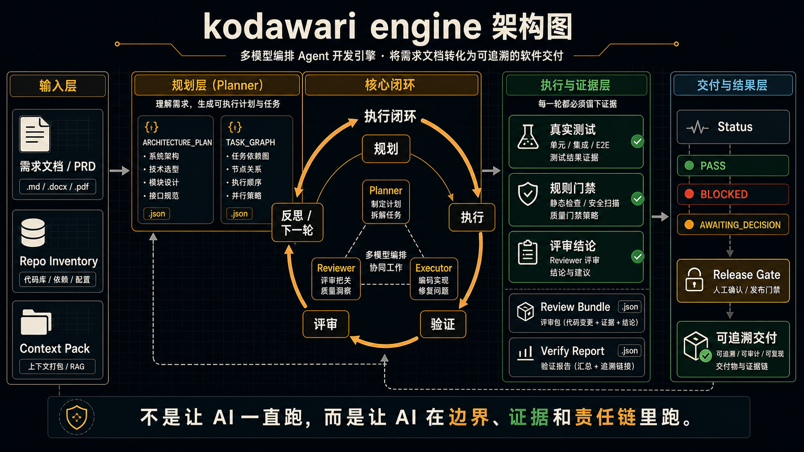

# kodawari

**Describe a feature in markdown. Get back tested, reviewed, ship-ready code — autonomously.**

[](https://www.python.org/downloads/)
[](LICENSE)
[](#status)
[](https://github.com/liafei/kodawari/actions/workflows/test.yml)

[English](README.md) · [中文](README.zh-CN.md) · [Deep dive](docs/PIPELINE_DEEP_DIVE.md) · [Quickstart](docs/QUICKSTART.md) · [Examples](examples/)

kodawari turns a written spec into a finished feature: it plans the work, writes
the code into your project, runs your tests, has a second AI model review the
result, fixes what review flags, and stops at a ship/no-ship decision for you.
**A pipeline, not a chat.**

**What makes it different**

- **Three LLMs, separate jobs** — one plans, one reviews, one writes. No model grades its own homework.
- **It can't fake a pass** — "tests passed" means `pytest` really ran and returned 0; "reviewed" means a second model really approved. No silent self-approval.
- **Every step is on the record** — spec → plan → task graph → task card, each a validated JSON artifact you can audit.
- **It learns across runs** — remembers recurring failures and carries the lessons forward, even into your other projects.

```text
PRD.md ──► plan → write code → run pytest → review → auto-fix ──► you approve → ship
```

**Concretely:** give it [a spec like this](examples/hello-bookmark/PRD.md)
(goals, scope, data contract, layers, tests) and from an *empty directory* you
get a working FastAPI service — `app/` code, `tests/` with passing pytest, and a
full JSON audit trail — stopped at a human ship/no-ship decision. That
[hello-bookmark example](examples/hello-bookmark/) is the 5-minute version; for
larger features you split the spec into **slices** and kodawari ships them one by
one, breaking each into a dependency-ordered task graph.

> **What counts as a spec?** A PRD, a task spec, a feature brief, an internal
> RFC — whatever your team writes. The intake parser reads **structure** (goals,
> scope, data contract, layers, acceptance criteria), not the filename. Pass it
> with `--prd <path>`. The 5-section recipe is in
> [docs/WRITING_PRD.md](docs/WRITING_PRD.md).

> *拘り (kodawari)* is Japanese for an obsessive, craftsman-like attention to
> detail — the refusal to accept anything less than what the work demands. The
> tool is named for the standard it tries to hold code to.

---

## ⚡ Quick start

```bash
pip install -e .                                # Python 3.11+
kodawari init-wizard                            # one-time config (interactive)
kodawari work-all --feature my-feature --prd ./PRD.md
```

That's the whole user-facing API for a real run. Two flags. Defaults
(peer review on, 5 cycles per task, 1h wall-clock ceiling, advisory
gate) are tuned for production use; override per-project via
`.claude/workflow/defaults.yaml` (generated by the wizard) or per-run
via CLI flags.

See [`examples/hello-bookmark/`](examples/hello-bookmark/) for a walkable
5-minute end-to-end demo (empty dir → FastAPI service + SQLite + tests,
generated entirely by the autopilot).

---

## 🗺️ How it works



Left to right: **inputs** (PRD, repo inventory, context) → **planner** → the
**core loop** where planner, reviewer, and executor pass the work around → the
**execution & evidence** layer (real tests, rules gate, review bundle, verify
report) → **delivery** (Status: PASS / BLOCKED / AWAITING_DECISION, release
gate). The loop is self-healing: `must_fix` items send the task back to be
re-written and re-checked, until it's approved or hits `max_cycles`.

### Roles

**Three LLM roles**, each configured independently in `.claude/workflow/models.yaml`:

| Role | What it does | Examples |
|---|---|---|
| **Planner** | Reads your spec and repo, then drafts the plan; revises when review pushes back | gpt-5, claude-opus, gemini-pro |
| **Reviewer** (plan + code) | Audits the plan and the code; can block with must-fix items | claude-opus, mimo, gpt-4o |
| **Executor** | Writes the code — and can only touch the files the task allows | mimo, codex, claude-haiku |

Mix providers freely — a cheap planner, a premium reviewer, and a local executor
is a common setup.

Full internal flow — every stage, every safety mechanism's code
location — see [docs/PIPELINE_DEEP_DIVE.md](docs/PIPELINE_DEEP_DIVE.md).

---

## 🤔 Why kodawari?

Most AI coding tools either chat with you (Claude Code, Cursor) or run on their
own but ask you to trust the result (Devin, OpenHands). kodawari is autonomous
*and* proves the result.

| Tool | Posture | What kodawari does differently |
|---|---|---|
| **Claude Code / Codex CLI** | Interactive REPL with one model per turn | Multi-model role separation + contract-first artifact chain. 5 chat sessions ≠ one planned PRD-driven feature. |
| **Cursor / Windsurf** | IDE-embedded editor with copilot+chat | Headless, scriptable, CI-friendly. No editor lock-in. Every step writes a JSON artifact for audit. |
| **Aider** | Git-aware pair-programmer for incremental edits | Greenfield-first (empty dir → shipped feature), strict verify+review gates that fail closed, planner can reject its own plan. |
| **OpenHands / Devin** | General-purpose autonomous agents | Narrower scope (Python project shipping), stricter no-fake-run guarantees, smaller blast radius. |

**Pick kodawari when you need:**

- A PRD → shipped feature **pipeline** rather than a chat session.
- Hard guarantees that "verify passed" actually means `pytest` ran and returned 0.
- Multi-LLM where each role is independently configurable.
- A CI-friendly autopilot that writes machine-readable artifacts at every step.

If you want a chatty pair-programmer, use one of the others — kodawari is
opinionated and process-heavy on purpose.

---

## 🛠️ What you get

**It proves its work — it can't fake a pass**

- **No fake runs.** Every "tests passed / review approved / gate passed" is bound to a real artifact on disk. If something can't be verified, it fails instead of quietly passing.
- **Real, scoped `pytest`.** Runs the actual tests for the files a task touched — and tells stale assertions apart from genuine breakages before retrying.
- **Code-quality gate.** A static redline check (complexity, nesting, layer boundaries) runs every task, in advisory / blocking / strict profiles.
- **Independent peer review + self-healing loop.** A second model reviews each task; `must_fix` items send it back to re-implement until approved or `max_cycles`.

**It learns from every run**

- **Cross-run memory (instincts).** It learns recurring failure patterns — a backend that keeps timing out, an auth/setup misconfig — and feeds those lessons into later prompts. Patterns that hold up across several runs are promoted to a machine-wide store (`~/.kodawari/instincts.json`), so a lesson learned in one project helps all your kodawari projects.
- **Self-repair.** After a failed run, `kodawari self-repair` reads the artifacts, proposes high-confidence fixes, can spawn a fresh autopilot to apply them, and records what worked as a reusable lesson. (Opt-in command, not a silent auto-fixer.)
- **Context auto-compaction.** As a run piles up errors and review findings, it automatically dedupes and compresses that history so the models keep a focused, budget-bounded view instead of dragging the whole transcript forward.

**It survives real-world failures**

- **Stall recovery.** Detects when the executor is reading without writing and forces it to act.
- **Rollback checkpoints.** Snapshots files before risky steps; restores on failure.
- **Escalation + replan.** On a real deadlock (task too big, model can't, repeated gate fails) it stops and asks you, with a failure-specific replanning prompt.
- **Wall-clock watchdog.** A whole-run time budget (default 1h) aborts cleanly with a report.
- **Blocked-by tracing.** When a task fails, downstream tasks report which failed ancestor blocks them.
- **Permission guard.** Protected-file and scope rules block out-of-bounds writes.

**It fits real projects**

- **Greenfield first-class** — empty dir + spec → scaffolded, tested project.
- **Multi-slice specs** — big features split into ordered slices (`## Slice N:`, `## Phase N:`, …), shipped one by one, resumable.
- **Complexity tiers** — auto lite / standard / heavy scaling of cycles and review rigor.
- **Pick your engine** — `codex_cli`, `claude_code`, `openai_tool_use`, or your own CLI; mix providers per role.
- **Contract-first artifacts** — spec → intake → plan → task-graph → task-card, all validated JSON you can audit.
- **Human ship gate** — stops at `AWAITING_DECISION`; you run `kodawari decide` to ship.

---

## ❓ FAQ

**What is kodawari?**
kodawari is a command-line tool that turns a written feature spec into finished,
tested code. You give it a markdown file; it plans the work, writes the code,
runs your tests, has a second AI model review the result, and hands you a
ready-to-ship feature to approve — like a small autonomous engineering team
(planner, reviewer, executor) working from a spec instead of a chat.

**How is kodawari different from Claude Code, Cursor, or Aider?**
Those are interactive, single-model pair-programmers. kodawari is a headless,
PRD-driven pipeline with separate planner / reviewer / executor models and a
contract-first artifact chain, so "verify passed" provably means tests ran and
a second model approved the code.

**Does kodawari actually run my tests, or just claim to?**
It runs them for real. Under `KODAWARI_REVIEW_ENABLED=1`, every verify command,
reviewer call, and gate decision is anchored to a real artifact, and silent-pass
fallback paths fail closed. That's the no-fake-run policy.

**Which LLMs and providers does it support?**
Each role is configured independently in `.claude/workflow/models.yaml`. You can
mix providers — a cheap planner, a premium reviewer, and a local executor is a
common setup. GPT, Claude, Gemini, and local models all work.

**Does it remember anything between runs?**
Yes. kodawari keeps a learned-instincts store: it records recurring failure
patterns (timeouts, auth/setup misconfigs) and feeds the lessons back into later
runs. Patterns that hold up across several runs are promoted to a machine-wide
store (`~/.kodawari/instincts.json`), so a lesson learned in one project helps
your others. You can also run `kodawari self-repair` to analyze a failed run and
propose fixes.

**Do I need a special PRD format?**
No. The intake parser reads structure — goals, scope, data contract, layers,
acceptance criteria — not the filename or document type. The 5-section recipe is
in [WRITING_PRD.md](docs/WRITING_PRD.md).

**Can it handle large or complex projects?**
Yes — that's what the structure is for. A big spec is split into ordered slices,
each broken into a dependency-aware task graph of focused tasks, with complexity
tiers (lite / standard / heavy) that scale the planning and review rigor to the
job. Bigger features cost more time and tokens, and the PRD intake heuristic is
currently most confident on web-service shapes (FastAPI-style) — other shapes
work but may need `kodawari init --archetype <name>`.

**Can it start from an empty directory?**
Yes. Greenfield is first-class: an empty dir plus a PRD produces a scaffolded,
tested feature. See [examples/hello-bookmark/](examples/hello-bookmark/).

**Is it production-ready?**
It's a public beta (v0.1.2), validated end-to-end on a greenfield FastAPI
service. Production-strict mode is the recommended config for non-toy projects.

---

## 📚 Documentation

| | |
|---|---|
| [QUICKSTART](docs/QUICKSTART.md) | First-run walkthrough — 30s noop, 10min Claude subscription, greenfield from empty dir |
| [USER_GUIDE](docs/USER_GUIDE.md) | Full operator manual |
| [WRITING_PRD](docs/WRITING_PRD.md) | **How to write a PRD kodawari understands** — read before your first real run |
| [PIPELINE_DEEP_DIVE](docs/PIPELINE_DEEP_DIVE.md) | **What actually happens inside `work-all`** — 8 stages, every safety mechanism's code location |
| [OPERATOR_RUNBOOK](docs/OPERATOR_RUNBOOK.md) | Error codes, troubleshooting, multi-slice diagnostics |
| [CAPABILITY_MAP](docs/CAPABILITY_MAP.md) | Capability × backend wiring matrix |
| [contracts/ENV_VAR_REFERENCE](docs/contracts/ENV_VAR_REFERENCE.md) | Every env var, what it does, defaults |
| [STABILITY](STABILITY.md) | Public API surface, CLI tiers, artifact schema, deprecation policy |
| [examples/hello-bookmark/](examples/hello-bookmark/) | 5-minute walkable end-to-end demo |
| [docs/](docs/README.md) | Full documentation index |

中文补充文档：[README.zh-CN.md](README.zh-CN.md) · [WRITING_PRD.zh-CN.md](docs/WRITING_PRD.zh-CN.md) · [PIPELINE_DEEP_DIVE.zh-CN.md](docs/PIPELINE_DEEP_DIVE.zh-CN.md) · [架构总览.zh-CN.md](docs/architecture/PLATFORM_OVERVIEW.zh-CN.md)

---

## 📊 Status

**v0.1.2 — public beta**. Validated end-to-end on a greenfield FastAPI
service: PRD → 5/5 tasks completed → 6/6 verify rounds with real
`pytest` invocations → 6/6 peer-review rounds (one self-healing
fix-loop on the route layer). Production-strict mode is the
recommended config for non-toy projects.

**Known limits:**

- PRD intake heuristic is conservative. Non-FastAPI shapes (CLI, lib,
  data pipeline) work but may produce a low-confidence intake;
  `kodawari init --archetype <name>` is the workaround.
- Release gate stops at `AWAITING_DECISION` by design — explicit
  `kodawari decide` step required before shipping.
- Env vars remain `WORKFLOW_*` prefixed (legacy from pre-rename);
  `KODAWARI_*` rename is planned for v0.2.

See [CHANGELOG.md](CHANGELOG.md) for the full release history.

---

## 🤝 Contributing

See [CONTRIBUTING.md](CONTRIBUTING.md). Ground rules in short:

1. **No silent-pass paths.** Every production code path under
   `KODAWARI_REVIEW_ENABLED=1` must fail closed.
2. **One feature per PR.** Don't bundle refactors with bug fixes.
3. **Test what you ship.** Removing one line of an implementation
   must cause at least one test to fail.
4. **Read the contract.** The artifact chain is schema-validated;
   propose schema bumps in the same PR as new fields.

---

## 📄 License

MIT — see [LICENSE](LICENSE).
