<div align="center">

# kodawari

**自主软件交付的 autopilot —— PRD 进、shipped feature 出，每一步都有严格的 no-fake-run 保证。**

[](https://www.python.org/downloads/)
[](LICENSE)
[](#状态)
[](#)

[English](README.md) · [中文](README.zh-CN.md) · [深度剖析](docs/PIPELINE_DEEP_DIVE.zh-CN.md) · [Quickstart](docs/QUICKSTART.md) · [示例](examples/)

</div>

> *拘り*（kodawari）—— 日语「对细节的执着、匠人不愿妥协的精神」。

kodawari 把一份 PRD 交给一条多 LLM 流水线（planner / reviewer / executor），
吐出一个已交付的 feature。每一步都有 **fail-closed 保证**：每个 "verify"
都真跑 `pytest`，每个 "peer review" 都真调一次 reviewer 模型，每个
"approval" 都锚定在 JSON artifact 上。production-strict 模式下没有任何
silent-pass 路径。

---

## ⚡ 快速上手

```bash
pip install -e .                                # Python 3.11+
kodawari init-wizard                            # 一次性配置（交互式）
kodawari work-all --feature my-feature --prd ./PRD.md
```

跑一次只要 2 个 flag。默认配置（peer review 开、每 task 5 cycle、1 小时
wall-clock 上限、advisory gate）调好给 production 用，要微调改
`.claude/workflow/defaults.yaml`（wizard 生成）或命令行临时传 flag。

参考 [`examples/hello-bookmark/`](examples/hello-bookmark/)——一个可走完的
5 分钟端到端例子（空目录 → FastAPI 服务 + SQLite + 测试，全部由 autopilot
生成）。

---

## 🗺️ 工作原理

```mermaid
flowchart LR
    PRD([📄 PRD.md]) --> TIER[Stage 0-1<br/>复杂度 tier<br/>+ slice 探测]
    TIER --> PLAN[Stage 2<br/>planner ↔ reviewer<br/>多轮互审]
    PLAN --> GRAPH[Stage 3-4<br/>架构方案 + scaffold<br/>+ TASK_GRAPH]
    GRAPH --> D[DESIGN]
    D --> I[IMPLEMENT]
    I --> V[VERIFY<br/>真跑 pytest]
    V --> R[RULES_GATE<br/>代码 redline]
    R --> RV[PEER_REVIEW<br/>impl_reviewer]
    RV -.must_fix.-> I
    RV --> BUNDLE[Stage 6-7<br/>review bundle<br/>+ release gate]
    BUNDLE -->|kodawari decide| SHIP([🚀 Ship])

    style PRD fill:#e8f4f8,stroke:#5c8aa0
    style SHIP fill:#d4f4dd,stroke:#3a8050
    style V fill:#fff4d6,stroke:#c89432
    style RV fill:#fff4d6,stroke:#c89432
```



PEER_REVIEW 回 IMPLEMENT 的虚线箭头是**自愈 fix-loop**：reviewer 标 `must_fix`
时，executor 重新实现、verify + review 重跑。直到 approved 或撞 `max_cycles`。

**三个 LLM 角色**，独立配置在 `.claude/workflow/models.yaml`：

| 角色 | 职责 | 示例 |
|---|---|---|
| **Planner** | 起草和修改 plan；读 PRD / 上轮 reviewer findings / repo inventory | gpt-5、claude-opus、gemini-pro |
| **Reviewer**（plan + impl） | 审计 plan 和代码；可以用 must-fix 卡住 | claude-opus、mimo、gpt-4o |
| **Executor** | 通过严格 tool-use 协议写代码；不能越过文件 scope | mimo、codex、claude-haiku |

可以混搭：便宜 planner + 高端 reviewer + 本地 executor 是常见组合。多 slice
PRD（`## Slice 1:` … `## Slice 2:` 标记）自动逐 slice 跑，支持 resume。

完整内部流程——每个 stage、每个安全机制对应的代码位置——见
[docs/PIPELINE_DEEP_DIVE.zh-CN.md](docs/PIPELINE_DEEP_DIVE.zh-CN.md)。

---

## 🤔 为什么用 kodawari？

| 工具 | 形态 | kodawari 差别 |
|---|---|---|
| **Claude Code / Codex CLI** | 交互式 REPL，单 model 单轮 | 多模型角色分离 + 契约优先 artifact 链。5 轮聊天 ≠ 一份 PRD 驱动的完整交付 |
| **Cursor / Windsurf** | IDE 内嵌编辑器 + copilot | Headless、可脚本化、CI 友好。不锁定编辑器。每步都吐 JSON artifact 给审计 |
| **Aider** | Git-aware 增量结对编程 | Greenfield 一等公民（空目录 → 完整 feature）；verify+review gate 严格 fail-closed；planner 可以否决自己 |
| **OpenHands / Devin** | 通用自主 agent | 范围更窄（Python 项目交付）、no-fake-run 保证更强、爆炸半径更小 |

**适合 kodawari 的场景**：

- 想要 PRD → 已交付 feature 的 **流水线**，而不是聊天
- 需要硬保证 "verify passed" 真的意味着 `pytest` 跑了并返回 0
- 多 LLM，每个角色独立可配
- CI 友好，每一步都吐机器可读的 artifact

如果你想要嘴贫的结对程序员，去用其它工具——kodawari 故意是 opinionated
+ process-heavy 的。

---

## 🛡️ 你能拿到的保证

- **No-fake-run policy**：`KODAWARI_REVIEW_ENABLED=1` 下，每个 reviewer
  调用、verify 命令、gate 决策都锚定到真 artifact。silent-pass fallback
  路径全部 fail-closed。
- **契约优先 artifact 链**：PRD → INTAKE → ARCHITECTURE_PLAN → TASK_GRAPH
  → TASK_CARD，端到端 JSON-schema 校验。
- **Greenfield 一等公民**：空目录 + PRD → 已交付 feature。`SCAFFOLD_MANIFEST`
  锁定 archetype，planner 不会在近空 filesystem 上重新推断。
- **Wall-clock 看门狗**：`--max-wall-clock-seconds`（默认 3600）超时写
  `ABORT_REPORT.json` 并 exit 124（POSIX 超时约定）。
- **闭包追溯的依赖跳过**：task 失败时下游 task 报 `blocked_by:
  [<failed-ancestor>]` 而非直接的 missing dep。
- **多 slice PRD**：写 `## Slice N: <title>`（或 `## 切片 N:`、`## Phase N:`、
  `## Part N:`）autopilot 自动按顺序跑每个 slice，支持 resume。

---

## 📚 文档

| | |
|---|---|
| [QUICKSTART](docs/QUICKSTART.md) | 首次跑通走查 —— 30s noop、10min Claude 订阅、空目录起步 |
| [USER_GUIDE](docs/USER_GUIDE.md) | 完整操作手册 |
| [WRITING_PRD.zh-CN](docs/WRITING_PRD.zh-CN.md) | **如何写 kodawari 喜欢的 PRD** —— 首次跑通必看 |
| [PIPELINE_DEEP_DIVE.zh-CN](docs/PIPELINE_DEEP_DIVE.zh-CN.md) | **`work-all` 内部真实流程** —— 8 个 stage、每个安全机制对应代码位置 |
| [OPERATOR_RUNBOOK](docs/OPERATOR_RUNBOOK.md) | 错码索引、故障排查、多 slice 诊断 |
| [CAPABILITY_MAP](docs/CAPABILITY_MAP.md) | capability × backend 兼容矩阵 |
| [contracts/ENV_VAR_REFERENCE](docs/contracts/ENV_VAR_REFERENCE.md) | 所有 env var 完整索引 |
| [examples/hello-bookmark/](examples/hello-bookmark/) | 5 分钟可走完的端到端例子 |

---

## 📊 状态

**v0.1.2 — public beta**。在 greenfield FastAPI 服务上完整端到端验证：
PRD → 5/5 task 完成 → 6/6 verify 真跑 pytest → 6/6 peer review 含 1 次
fix-loop 自愈。非玩具项目推荐用 production-strict mode。

**已知限制**：

- PRD intake 启发式偏保守。非 FastAPI 形态（CLI / lib / data pipeline）
  能跑但可能产生低置信度 intake；`kodawari init --archetype <name>` 显
  式指定是 workaround。
- Release gate 设计上停在 `AWAITING_DECISION` —— 必须显式
  `kodawari decide` 才能 ship。
- env vars 当前还是 `WORKFLOW_*` 前缀（pre-rename 遗留）；`KODAWARI_*`
  重命名规划在 v0.2。

完整发布历史见 [CHANGELOG.md](CHANGELOG.md)。

---

## 🤝 贡献

见 [CONTRIBUTING.md](CONTRIBUTING.md)。核心规则：

1. **不允许 silent-pass 路径**。`KODAWARI_REVIEW_ENABLED=1` 下每条生
   产代码路径都必须 fail closed。
2. **一个 PR 一个 feature**。不要把 refactor 和 bug fix 捆一起。
3. **测什么写什么**。删一行实现，至少要有一个测试 fail。
4. **读契约**。artifact 链是 schema 校验的；加新字段要在同一 PR
   里 propose schema bump。

---

## 📄 协议

MIT —— 见 [LICENSE](LICENSE)。
