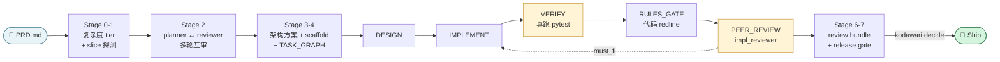

<div align="center">

# kodawari

**用 markdown 写一份功能说明，拿回测过、审过、能直接上线的代码——全自动。**

[](https://www.python.org/downloads/)
[](LICENSE)
[](#状态)
[](https://github.com/liafei/kodawari/actions/workflows/test.yml)

[English](README.md) · [中文](README.zh-CN.md) · [深度剖析](docs/PIPELINE_DEEP_DIVE.zh-CN.md) · [Quickstart](docs/QUICKSTART.md) · [示例](examples/)

</div>

kodawari 把一份写好的说明变成一个做完的功能：它规划、把代码写进你的项目、跑你
的测试、让第二个 AI 模型审查结果、按审查返工，最后停在「上不上线」等你拍板。
**是流水线，不是聊天。**

**它哪里不一样**

- **三个 LLM，分工不同** — 一个规划、一个审查、一个写码。没有模型给自己打分。
- **它没法假装通过** — 「测试通过」=`pytest` 真跑了且返回 0；「审过」=第二个模型真批了。不存在偷偷自评放行。
- **全程留痕** — spec → 计划 → task graph → task card，每一步都是可审计的、校验过的 JSON。
- **它会跨运行学习** — 记住反复出现的失败，把教训带到以后，甚至带到你别的项目。

```text
PRD.md ──► 规划 → 写代码 → 跑 pytest → 审查 → 自动返工 ──► 你拍板 → 上线
```

**具体来说**：给它[一份这样的说明](examples/hello-bookmark/PRD.md)（目标 / 范围 /
数据契约 / 分层 / 测试），从一个空目录，你会得到一个能跑的 FastAPI 服务——`app/`
代码、`tests/` 里能过的 pytest、一整套 JSON 审查记录——并停在「上不上线」的人工
决策点。这个 [hello-bookmark 例子](examples/hello-bookmark/) 是 5 分钟版；更大的
功能就把 spec 切成 **slice**，kodawari 逐个交付，每个 slice 再拆成带依赖顺序的
task graph。

> **什么算"说明"？** PRD、任务规格、需求说明、内部 RFC——你团队怎么叫都行。
> intake 解析器看的是**结构**（目标 / 范围 / 数据契约 / 分层 / acceptance
> criteria），不看文件名。用 `--prd <path>` 传入。5 段模板见
> [docs/WRITING_PRD.zh-CN.md](docs/WRITING_PRD.zh-CN.md)。

> *拘り*（kodawari）—— 日语「对细节的执着、匠人不愿妥协的精神」。工具以此命名，
> 是想把代码也守在这个标准上。

---

## ⚡ 快速上手

```bash
pip install -e .                                # Python 3.11+
kodawari init-wizard                            # 一次性配置（交互式）
kodawari work-all --feature my-feature --prd ./PRD.md
```

跑一次只要 2 个 flag。默认配置（peer review 开、每 task 5 cycle、1 小时
wall-clock 上限、advisory gate）调好给 production 用，要微调改
`.claude/workflow/defaults.yaml`（wizard 生成）或命令行临时传 flag。

参考 [`examples/hello-bookmark/`](examples/hello-bookmark/)——一个可走完的
5 分钟端到端例子（空目录 → FastAPI 服务 + SQLite + 测试，全部由 autopilot
生成）。

---

## 🗺️ 工作原理


```mermaid
flowchart LR
    PRD([📄 PRD.md]) --> TIER[Stage 0-1<br/>复杂度 tier<br/>+ slice 探测]
    TIER --> PLAN[Stage 2<br/>planner ↔ reviewer<br/>多轮互审]
    PLAN --> GRAPH[Stage 3-4<br/>架构方案 + scaffold<br/>+ TASK_GRAPH]
    GRAPH --> D[DESIGN]
    D --> I[IMPLEMENT]
    I --> V[VERIFY<br/>真跑 pytest]
    V --> R[RULES_GATE<br/>代码 redline]
    R --> RV[PEER_REVIEW<br/>impl_reviewer]
    RV -.must_fix.-> I
    RV --> BUNDLE[Stage 6-7<br/>review bundle<br/>+ release gate]
    BUNDLE -->|kodawari decide| SHIP([🚀 Ship])

    style PRD fill:#e8f4f8,stroke:#5c8aa0
    style SHIP fill:#d4f4dd,stroke:#3a8050
    style V fill:#fff4d6,stroke:#c89432
    style RV fill:#fff4d6,stroke:#c89432
```

PEER_REVIEW 回 IMPLEMENT 的虚线箭头是**自愈 fix-loop**：reviewer 标 `must_fix`
时，executor 重新实现、verify + review 重跑。直到 approved 或撞 `max_cycles`。

### 平实说一遍这 5 步

**1. 读取 + 切片。** spec 里有 `## Slice 1:`、`## Slice 2:` … 标记 → 按顺序逐个
交付；没有就当一个整体。

**2. 规划。** planner 起草实现方案——要改哪些文件、写什么测试、数据契约。
reviewer 审这份方案，有 must_fix 就打回去改，两边来回直到方案站得住。

**3. 拆成 task。** 通过的方案被拆成 5–7 个小 task，每个只动一组聚焦的文件，并记
录依赖关系，好按正确顺序跑。

**4. 每个 task：写代码、跑测试、过审。** 每个 task：executor 写代码 → `pytest`
真跑 → 代码质量门禁真跑 → reviewer 审结果。被标 must_fix 就打回重做重审。通过
→ 下一个 task。

**5. 停下来等你拍板。** 所有 task 都过了，kodawari 把改动打包，然后停住——不会自
己上线。你跑 `kodawari decide --action accept` 上线，或 `--action reject` 停。

多 slice spec 的话，**步骤 2–4 每个 slice 跑一遍**，步骤 5 在所有 slice 完
成后跑一次。

### 角色配置

**三个 LLM 角色**，独立配置在 `.claude/workflow/models.yaml`：

| 角色 | 职责 | 示例 |
|---|---|---|
| **Planner** | 起草和修改 plan；读 PRD / 上轮 reviewer findings / repo inventory | gpt-5、claude-opus、gemini-pro |
| **Reviewer**（plan + impl） | 审计 plan 和代码；可以用 must-fix 卡住 | claude-opus、mimo、gpt-4o |
| **Executor** | 通过严格 tool-use 协议写代码；不能越过文件 scope | mimo、codex、claude-haiku |

可以混搭：便宜 planner + 高端 reviewer + 本地 executor 是常见组合。多 slice
PRD（`## Slice 1:` … `## Slice 2:` 标记）自动逐 slice 跑，支持 resume。

完整内部流程——每个 stage、每个安全机制对应的代码位置——见
[docs/PIPELINE_DEEP_DIVE.zh-CN.md](docs/PIPELINE_DEEP_DIVE.zh-CN.md)。

---

## 🤔 为什么用 kodawari？

大多数 AI 编码工具，要么陪你聊（Claude Code、Cursor），要么能自主跑但要你信结
果（Devin、OpenHands）。kodawari 是自主的，**而且会证明结果**。

| 工具 | 形态 | kodawari 差别 |
|---|---|---|
| **Claude Code / Codex CLI** | 交互式 REPL，单 model 单轮 | 多模型角色分离 + 契约优先 artifact 链。5 轮聊天 ≠ 一份 PRD 驱动的完整交付 |
| **Cursor / Windsurf** | IDE 内嵌编辑器 + copilot | Headless、可脚本化、CI 友好。不锁定编辑器。每步都吐 JSON artifact 给审计 |
| **Aider** | Git-aware 增量结对编程 | Greenfield 一等公民（空目录 → 完整 feature）；verify+review gate 严格 fail-closed；planner 可以否决自己 |
| **OpenHands / Devin** | 通用自主 agent | 范围更窄（Python 项目交付）、no-fake-run 保证更强、爆炸半径更小 |

**适合 kodawari 的场景**：

- 想要 PRD → 已交付 feature 的 **流水线**，而不是聊天
- 需要硬保证 "verify passed" 真的意味着 `pytest` 跑了并返回 0
- 多 LLM，每个角色独立可配
- CI 友好，每一步都吐机器可读的 artifact

如果你想要嘴贫的结对程序员，去用其它工具——kodawari 故意是 opinionated
+ process-heavy 的。

---

## 🛠️ 你能得到什么

**它会证明自己真做了——没法假装通过**

- **没有假运行。** 每一句「测试通过 / 审查通过 / 门禁通过」都绑定到磁盘上一份真实记录。验证不了就直接失败，而不是悄悄放行。
- **真跑、且按范围跑 `pytest`。** 只跑这个 task 改动到的文件相关的测试——而且在重试前能区分「过时的断言」和「真正的回归」。
- **代码质量门禁。** 每个 task 都跑一遍静态红线检查（复杂度、嵌套、分层边界），分 advisory / blocking / strict 三档。
- **独立 peer review + 自愈循环。** 第二个模型审查每个 task；`must_fix` 项会把它打回重写，直到通过或撞 `max_cycles`。

**它会从每次运行里学习**

- **跨运行记忆（instincts）。** 它会学习反复出现的失败模式——某个后端老超时、某处 auth/setup 配错——并把这些教训喂进之后的 prompt。撑过几次运行的稳定模式会被提升到一个机器级共享库（`~/.kodawari/instincts.json`），于是在一个项目里学到的教训，你其它 kodawari 项目也能直接受益。
- **自修复（self-repair）。** 运行失败后，`kodawari self-repair` 会读取产物、给出高置信度的修复建议，可以再拉起一个 autopilot 去应用，并把真正有效的修复记成可复用的教训。（是你主动调的命令，不是偷偷自动改。）
- **上下文自动压缩。** 随着一次运行堆积越来越多错误和审查意见，它会自动去重、压缩这些历史，让模型保持一个聚焦、受预算约束的视图，而不是把整段对话一路拖下去。

**它扛得住真实世界的各种状况**

- **卡死恢复。** 检测到 executor 只读不写卡住时，强制它动手（写/删）。
- **回滚检查点。** 在有风险的步骤前给文件拍快照，失败就还原。
- **升级 + 重规划。** 真遇到死局（task 太大、模型搞不定、门禁反复挂）时停下来问你，并带一个针对该失败类型的重规划 prompt。
- **墙钟看门狗。** 整轮有时间预算（默认 1 小时），超时干净中止并写报告。
- **阻塞溯源。** 一个 task 挂了，下游 task 会告诉你是被哪个失败的上游挡住。
- **权限护栏。** 受保护文件和范围规则会拦掉越界写入。

**它适配真实项目**

- **Greenfield 一等公民**——空目录 + spec → 带脚手架、带测试的项目。
- **多 slice 规格**——大功能切成有序 slice（`## Slice N:`、`## Phase N:` …），逐个交付，可续跑。
- **复杂度分级**——自动按 lite / standard / heavy 调节循环轮次和审查严格度。
- **执行引擎可选**——`codex_cli`、`claude_code`、`openai_tool_use`，或你自己的 CLI；每个角色可混搭不同厂商。
- **契约优先产物**——spec → intake → plan → task-graph → task-card，全是可审计的、校验过的 JSON。
- **人工上线门**——停在 `AWAITING_DECISION`；你跑 `kodawari decide` 才上线。

---

## ❓ 常见问题

**kodawari 是什么？**
kodawari 是一个命令行工具，把一份写好的功能说明变成写完、测过的代码。你给它一
个 markdown 文件；它规划、写代码、真跑你的测试、让第二个 AI 模型审查结果，最后
交给你一个可以直接上线的功能等你拍板——像一个按说明书干活、而不是陪你聊天的自
动工程团队（一个规划、一个审查、一个写码）。

**kodawari 和 Claude Code / Cursor / Aider 有什么区别？**
那些是交互式、单模型的结对编程工具。kodawari 是 headless、PRD 驱动的流水线，
planner / reviewer / executor 分离，配契约优先的 artifact 链——所以 "verify
passed" 可证明地意味着测试真跑了、而且有第二个模型批准了代码。

**kodawari 是真跑测试还是只是声称跑了？**
真跑。在 `KODAWARI_REVIEW_ENABLED=1` 下，每个 verify 命令、reviewer 调用、gate
决策都锚定到真 artifact，silent-pass fallback 路径全部 fail-closed。这就是
no-fake-run policy。

**支持哪些 LLM 和厂商？**
三个角色在 `.claude/workflow/models.yaml` 里各自独立配置，可以混搭——便宜
planner + 高端 reviewer + 本地 executor 是常见组合。GPT、Claude、Gemini、本地
模型都能用。

**它会在多次运行之间记忆吗？**
会。kodawari 有一个 learned-instincts 库：记录反复出现的失败模式（超时、auth/
setup 配错），把教训喂进之后的运行。撑过几次运行的稳定模式会被提升到机器级共享
库（`~/.kodawari/instincts.json`），于是一个项目里学到的教训，你别的项目也能受
益。也可以跑 `kodawari self-repair` 分析失败的运行并给出修复建议。

**需要特定的 PRD 格式吗？**
不需要。intake 解析器看的是**结构**——目标 / 范围 / 数据契约 / 分层 /
acceptance criteria，而不是文件名或文档类型。5 段模板见
[WRITING_PRD.zh-CN.md](docs/WRITING_PRD.zh-CN.md)。

**能跑复杂工程吗？**
能——这套结构就是为此设计的。一份大 spec 会被切成有序的 slice，每个 slice 再拆
成带依赖关系的 task graph（一组聚焦的小 task），并用复杂度 tier（lite / standard
/ heavy）按工程大小调节规划和审查的严格度。工程越大、耗时和 token 越多；目前
intake 启发式对 Web 服务形态（FastAPI 类）最有把握，其它形态也能跑，可能需要
`kodawari init --archetype <name>`。

**能从空目录起步吗？**
能。Greenfield 是一等公民：空目录 + 一份 PRD → 带脚手架、带测试的 feature。见
[examples/hello-bookmark/](examples/hello-bookmark/)。

**能用于生产吗？**
当前是 public beta（v0.1.2），已在 greenfield FastAPI 服务上完整端到端验证。非
玩具项目推荐用 production-strict mode。

---

## 📚 文档

| | |
|---|---|
| [QUICKSTART](docs/QUICKSTART.md) | 首次跑通走查 —— 30s noop、10min Claude 订阅、空目录起步 |
| [USER_GUIDE](docs/USER_GUIDE.md) | 完整操作手册 |
| [WRITING_PRD.zh-CN](docs/WRITING_PRD.zh-CN.md) | **如何写 kodawari 喜欢的 PRD** —— 首次跑通必看 |
| [PIPELINE_DEEP_DIVE.zh-CN](docs/PIPELINE_DEEP_DIVE.zh-CN.md) | **`work-all` 内部真实流程** —— 8 个 stage、每个安全机制对应代码位置 |
| [OPERATOR_RUNBOOK](docs/OPERATOR_RUNBOOK.md) | 错码索引、故障排查、多 slice 诊断 |
| [CAPABILITY_MAP](docs/CAPABILITY_MAP.md) | capability × backend 兼容矩阵 |
| [contracts/ENV_VAR_REFERENCE](docs/contracts/ENV_VAR_REFERENCE.md) | 所有 env var 完整索引 |
| [STABILITY](STABILITY.md) | 公共 API、CLI 分层、artifact schema、废弃策略 |
| [examples/hello-bookmark/](examples/hello-bookmark/) | 5 分钟可走完的端到端例子 |
| [docs/](docs/README.md) | 完整文档索引 |

---

## 📊 状态

**v0.1.2 — public beta**。在 greenfield FastAPI 服务上完整端到端验证：
PRD → 5/5 task 完成 → 6/6 verify 真跑 pytest → 6/6 peer review 含 1 次
fix-loop 自愈。非玩具项目推荐用 production-strict mode。

**已知限制**：

- PRD intake 启发式偏保守。非 FastAPI 形态（CLI / lib / data pipeline）
  能跑但可能产生低置信度 intake；`kodawari init --archetype <name>` 显
  式指定是 workaround。
- Release gate 设计上停在 `AWAITING_DECISION` —— 必须显式
  `kodawari decide` 才能 ship。
- env vars 当前还是 `WORKFLOW_*` 前缀（pre-rename 遗留）；`KODAWARI_*`
  重命名规划在 v0.2。

完整发布历史见 [CHANGELOG.md](CHANGELOG.md)。

---

## 🤝 贡献

见 [CONTRIBUTING.md](CONTRIBUTING.md)。核心规则：

1. **不允许 silent-pass 路径**。`KODAWARI_REVIEW_ENABLED=1` 下每条生
   产代码路径都必须 fail closed。
2. **一个 PR 一个 feature**。不要把 refactor 和 bug fix 捆一起。
3. **测什么写什么**。删一行实现，至少要有一个测试 fail。
4. **读契约**。artifact 链是 schema 校验的；加新字段要在同一 PR
   里 propose schema bump。

---

## 📄 协议

MIT —— 见 [LICENSE](LICENSE)。
