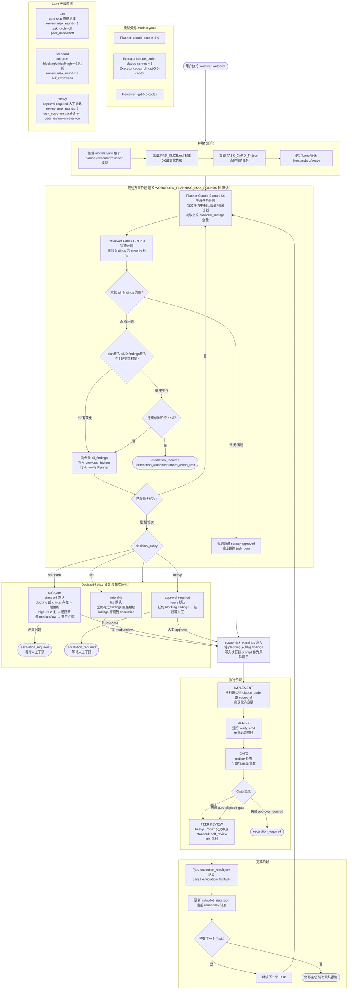

```mermaid

flowchart TD
    START([用户执行 kodawari autopilot]) --> SETUP

subgraph SETUP["初始化阶段"]
    S1[加载 models.yaml 解析 planner/executor/reviewer 模型]
    S2[加载 PRD_SLICE.md 权重0.6最高优先级]
    S3[加载 TASK_CARD_Tn.json 确定当前任务]
    S4[确定 Lane 等级 lite/standard/heavy]
    S1 --> S2 --> S3 --> S4
end

SETUP --> P1

subgraph PLAN["规划互审阶段 最多 WORKFLOW_PLANNING_MAX_ROUNDS 轮 默认3"]
    P1["Planner Claude Sonnet 4.6\n生成任务计划\n含文件清单/接口签名/测试计划\n读取上轮 previous_findings 全量"]
    P2["Reviewer Codex GPT-5.3\n审查计划\n输出 findings 含 severity 标记"]
    P3{本轮 all_findings 为空?}
    P_STUB{plan签名 AND findings签名\n与上轮完全相同?}
    P_STUBCOUNT{连续顽固轮次 >= 2?}
    P4[将全量 all_findings\n写入 previous_findings\n传入下一轮 Planner]
    P5{已到最大轮次?}
    P6[规划通过 status=approved\n输出最终 task_plan]
    P_ESC([escalation_required\ntermination_reason=stubborn_round_limit])

    P1 --> P2 --> P3
    P3 -->|是 无问题| P6
    P3 -->|否 有问题| P_STUB
    P_STUB -->|否 有变化| P4
    P_STUB -->|是 无变化| P_STUBCOUNT
    P_STUBCOUNT -->|是| P_ESC
    P_STUBCOUNT -->|否| P4
    P4 --> P5
    P5 -->|否| P1
    P5 -->|是 超轮次| DP
end

P6 --> E_WARN
DP --> POLICY

subgraph POLICY["Decision Policy 分支 超轮次后执行"]
    DP{decision_policy}

    DP_AS["auto-skip\nlite 默认\n无论有无 findings 直接继续\nfindings 留痕到 escalation"]
    DP_SG["soft-gate\nstandard 默认\nblocking 或 critical 存在 → 硬阻断\nhigh >= 2 条 → 硬阻断\n仅 medium/low → 警告继续"]
    DP_AR["approval-required\nheavy 默认\n任何 blocking findings → 挂起等人工"]

    DP -->|lite| DP_AS
    DP -->|standard| DP_SG
    DP -->|heavy| DP_AR

    DP_SG -->|严重问题| STOP_SG([escalation_required\n等待人工干预])
    DP_AR -->|有 blocking| STOP_AR([escalation_required\n等待人工干预])
end

DP_AS --> E_WARN
DP_SG -->|仅 medium/low| E_WARN
DP_AR -->|人工 approve| E_WARN

E_WARN["scope_risk_warnings 注入\n将 planning 未解决 findings\n写入执行器 prompt 作为风险提示"]

E_WARN --> E1

subgraph EXEC["执行阶段"]
    E1["IMPLEMENT\n执行器运行 claude_code 或 codex_cli\n实现代码变更"]
    E2["VERIFY\n运行 verify_cmd\n单测必须通过"]
    E3["GATE\nredline 检查\n行数/复杂度/嵌套"]
    E4{Gate 结果}
    E5["PEER REVIEW\nheavy: Codex 交叉审查\nstandard: self_review\nlite: 跳过"]

    E1 --> E2 --> E3 --> E4
    E4 -->|通过| E5
    E4 -->|失败 auto-skip/soft-gate| E5
    E4 -->|失败 approval-required| STOP_GATE([escalation_required])
end

E5 --> D1

subgraph DONE["完成阶段"]
    D1["写入 execution_result.json\n记录 pass/fail/violations/artifacts"]
    D2["更新 autopilot_state.json\n当前 round/task 进度"]
    D3{还有下一个 Task?}
    D4[继续下一个 Task]
    D5([全部完成 输出最终报告])

    D1 --> D2 --> D3
    D3 -->|是| D4
    D4 --> P1
    D3 -->|否| D5
end

subgraph MODELS["模型分配 models.yaml"]
    M1["Planner: claude-sonnet-4-6"]
    M2["Executor claude_code: claude-sonnet-4-6\nExecutor codex_cli: gpt-5.3-codex"]
    M3["Reviewer: gpt-5.3-codex"]
end

subgraph LANES["Lane 等级对照"]
    L1["Lite\nauto-skip 直接继续\nreview_max_rounds=1\ntask_cycle=off peer_review=off"]
    L2["Standard\nsoft-gate blocking/critical/high>=2 阻断\nreview_max_rounds=2\nself_review=on"]
    L3["Heavy\napproval-required 人工确认\nreview_max_rounds=3\ntask_cycle=on parallel=on peer_review=on eval=on"]
end
```
