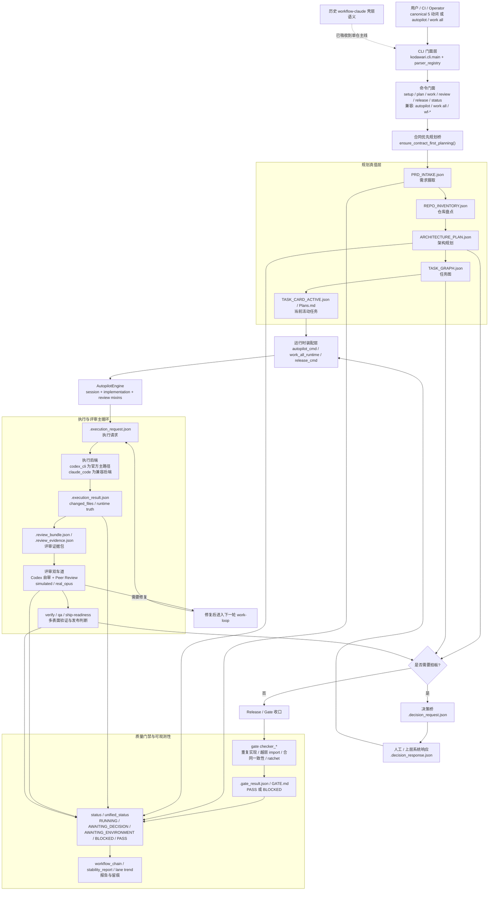
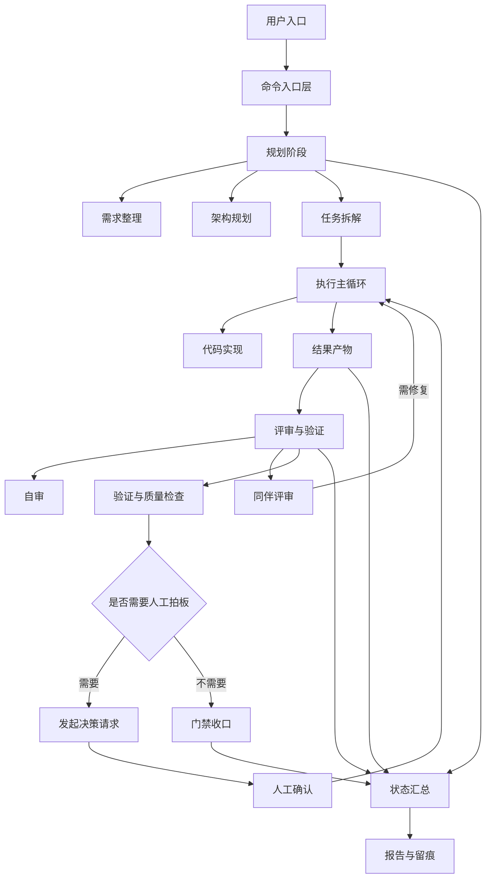

# 三、中文架构流程图

## 1. 为什么之前看起来“没有了”

旧现场里的 `workflow_flowchart*.mmd` 与早期双仓口径已经不再可靠。
当前主线已经收束为“`kodawari` 单仓承载 planning + runtime + review + gate + status”，所以仓内之前只保留了一张最小英文图，避免继续传播过时结构。

本文件把现行主线重新画成中文版本，和当前 `docs/一、平台现状、架构与兼容总览.md`、`docs/二、运行操作、门禁规则与后续路线.md` 对齐。

## 2. 中文主架构图

Mermaid 源文件同步放在：

- `docs/diagrams/autopilot_flow.mmd`

## 3. 简化版中文架构图

这张图对应的 Mermaid 源文件放在：

- `docs/diagrams/simple_cn_flow.mmd`

## 4. 读图说明

- 顶层入口分成两类：对最终用户推荐的是 `setup -> plan -> work -> review -> release -> status`，对 operator / CI 保留 `autopilot`、`work all` 这类快速入口。
- 规划链已经固定为 contract-first 真值链，核心是 `PRD_INTAKE.json -> REPO_INVENTORY.json -> ARCHITECTURE_PLAN.json -> TASK_GRAPH.json -> TASK_CARD_ACTIVE.json`。
- runtime 主循环以 `AutopilotEngine` 为内核，先产出 execution truth，再进入 review、verify、qa 与 ship-readiness。
- review 已不是单点动作，而是 `Codex 自审 + Peer Review` 的双层闭环；若 `must_fix` 未清零，就重新回到 work-loop。
- 一旦遇到意图澄清、架构冻结、任务图冻结或发布审批，系统会落地 `.decision_request.json`，等 `.decision_response.json` 回来后继续推进。
- 最终不是“只跑完一个命令就算结束”，而是统一收口到 gate、status 与 report，让 `PASS / BLOCKED / AWAITING_*` 真值对外保持一致。
